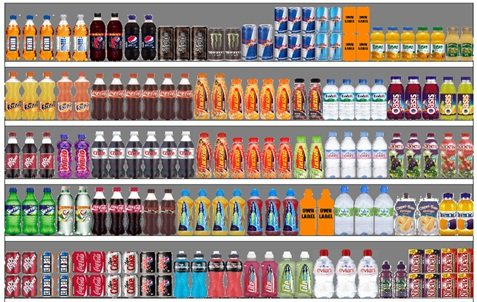

# Grocery-shelves
### Recognition of Product Positions on Shelf Images with Deep Learning in Keras / Tensorflow



## Introduction

### What is a planogram?
- Visual description of the retail products' placement on shelves.

Convolutional Neural Networks (CNN) have made a revolution in Computer Vision and have changed the way of thinking of such tasks.
Also user friendly API keras is used.

This work shows the power of these cutting edge techniques. It will show that all algorithms proposed above could be easily replaced
by only 2 CNNs with increase of recognition quality without losing performance.

## Steps

All steps are implemented as spyder environment and could be read without execution:
*   [step 1 - Data Preparation](https://github.com/Vik-Mal/Product-recognition-on-the-shelves-using-neural-networks-using-Keras-and-Tensorflow/blob/master/step%201%20-%20Data%20Preparation.py)
*   [step 2 - Brand recognition with CNN](https://github.com/Vik-Mal/Product-recognition-on-the-shelves-using-neural-networks-using-Keras-and-Tensorflow/blob/master/step%202%20-%20Brand%20recognition%20with%20CNN.py)

## Dependencies

Solution depends on the following main libraries:
*   Tensorlfow
*   Keras

Keras can be installed using pip:
``` bash
pip install keras
```


